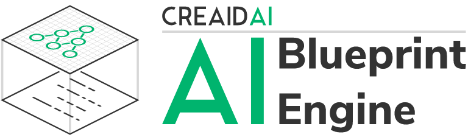

  

# AI Blueprint Engine: A code generator for Deep Learning

> Try our [public beta release](https://blueprints.creaidai.com).

We provide several pre-designed architectures as examples:

- [Logistic regression](https://blueprints.creaidai.com/examples/logistic_regression) with multiple input data types
- [Classic CNN](https://blueprints.creaidai.com/examples/classic_cnn) for multi-class image classification
- [VGG-19](https://blueprints.creaidai.com/examples/vgg19) for multi-class image classification
- [Inception](https://blueprints.creaidai.com/examples/inception) for multi-class image classification
- [LSTM](https://blueprints.creaidai.com/examples/lstm_signal_classification) for sequence classification

For feature requests and bugs, file an [issue](https://github.com/creaidAI/blueprints/issues).
